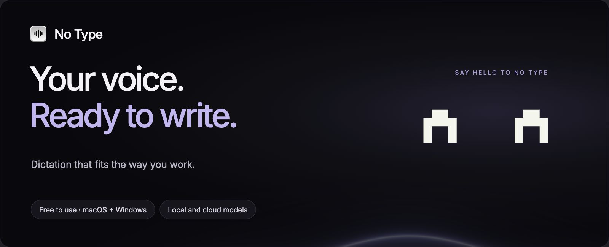
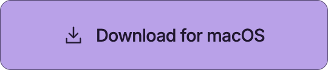
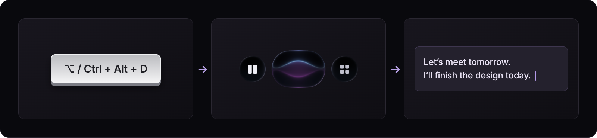
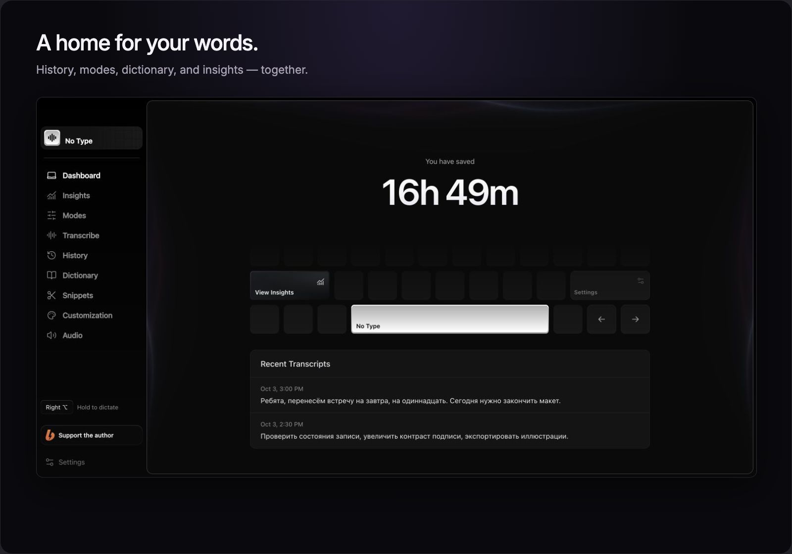
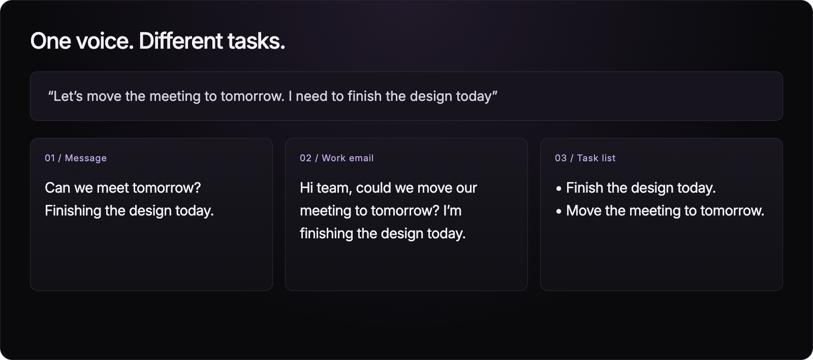
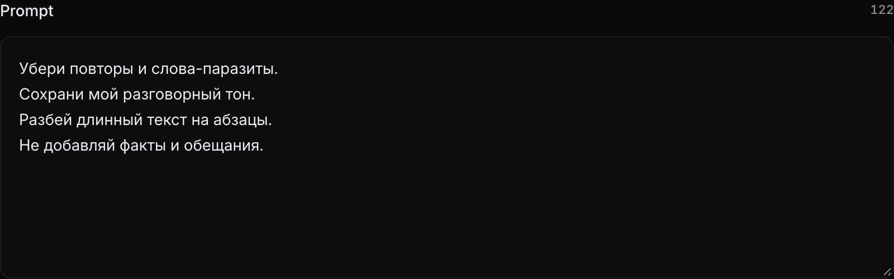
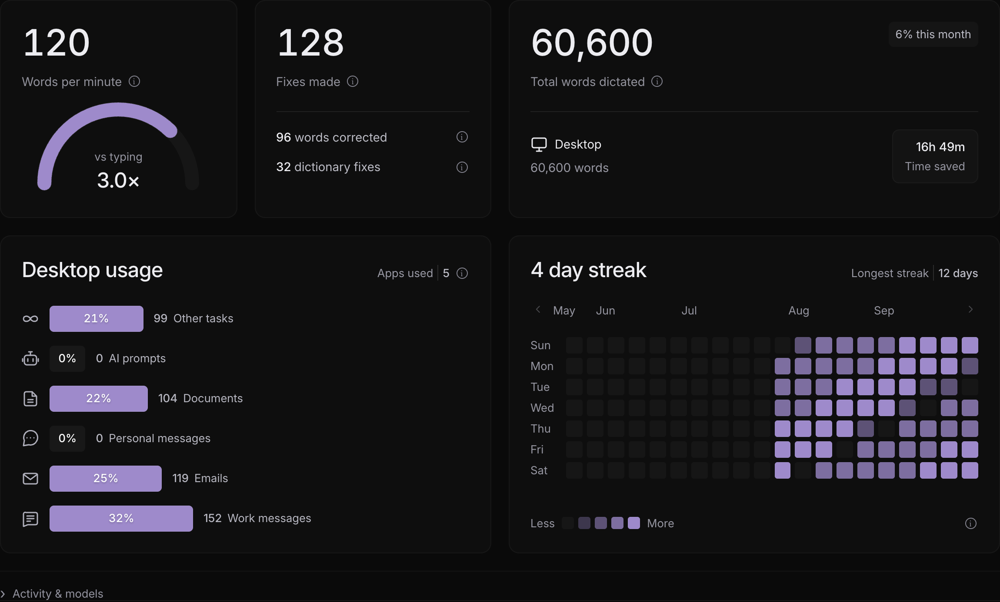
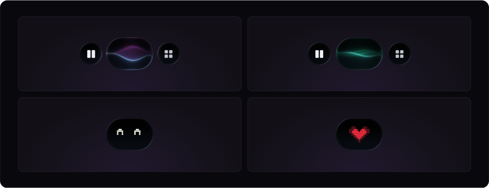
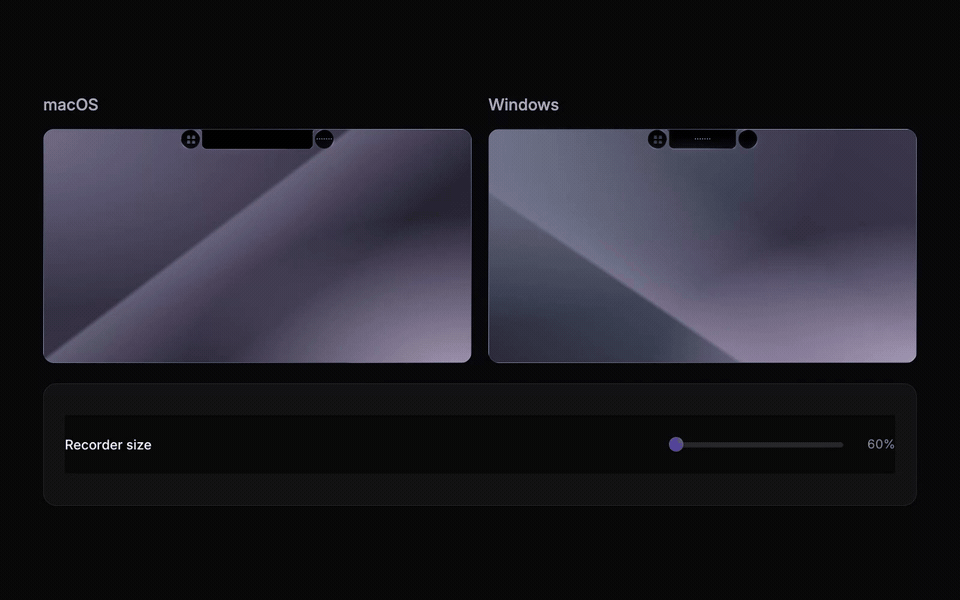
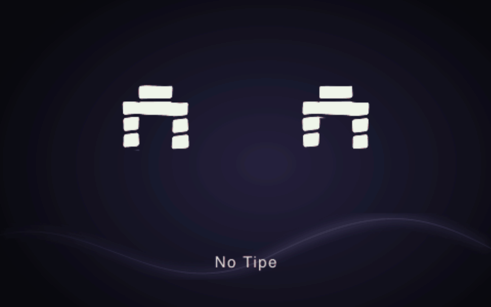

<a href="README.md">Русский</a> · <strong>English</strong>

  <picture>
  <source media="(max-width: 600px)" srcset="assets/hero-en-mobile.png" />
  
</picture>

  
  
  

  <a href="https://www.notype.tech">Website</a> ·
  <a href="https://github.com/Darlingfxx02/no-tipe-releases/releases/latest">Latest release</a> ·
  <a href="https://github.com/Darlingfxx02/no-tipe-releases/releases">All versions</a> ·
  <a href="https://github.com/Darlingfxx02/no-tipe-releases/issues">Feedback</a>

**No Type turns speech into text for your apps.** Press a shortcut, say what you have in mind, and get text in the focused field. Choose local or cloud models, shape the output with writing modes, and make the little recorder your own.

Free for personal and professional use. Supporting the author is optional; every feature is available without a donation. Cloud providers charge separately under their own pricing.

## From thought to text in three steps

<picture>
  <source media="(max-width: 600px)" srcset="assets/flow-en-mobile.png" />
  
</picture>

Hold your shortcut while speaking, or press it to start and stop. Change the shortcut and recording behavior in settings. On macOS, text insertion needs Accessibility permission; without it, the result is copied to the clipboard.

Windows defaults to Right Ctrl: hold it while speaking and release to finish. Updates keep your saved shortcut.

## A home for your words

Actual application interface. History and statistics in these images are demo data; time saved is an estimate.

| Feature | What you can do |
| :--- | :--- |
| **Local and cloud models** | Download a speech model to your computer or connect a cloud provider using your own API key. |
| **Writing modes** | Set instructions for messages, emails, notes, and tasks; enable enhancement, shortening, or translation. |
| **Personal dictionary** | Add names, terms, and your own corrections. |
| **Snippets** | Keep frequently used text fragments at hand. |
| **History and audio** | Revisit dictations and retry recognition from saved audio. |
| **Insights** | Explore word counts, speaking speed, activity, and dictation usage across apps. |
| **English and Russian UI** | Select a language or follow your system language. |

## One phrase, different results

<picture>
  <source media="(max-width: 600px)" srcset="assets/modes-en-mobile.png" />
  
</picture>

A mode defines what happens to your transcript. Edit its instructions to remove repetition, preserve your tone, add paragraphs, or translate the text. Choose a local or cloud text model to process it.

The diagram uses illustrative text examples, not model benchmark results.

<strong>See the instruction editor and insights</strong>

### Your instructions for the text

### How you use dictation

## A little personality

<picture>
  <source media="(max-width: 600px)" srcset="assets/recorder-en-mobile.png" />
  
</picture>

Pick waves or a pixel companion, adjust the size, and choose a palette. The robot reacts when you pet it with your pointer. Place the recorder in a floating bubble or along the top edge of your screen.

<strong>Watch the top-edge recorder in motion</strong>

The current recorder component shown against abstract macOS and Windows backgrounds.

## Download and get started

### Build 0.1.4

The project is now **No Type**. Published 0.1.4 installers still use the earlier **No Tipe** name.

| Platform | Requirements | Installer |
| :--- | :--- | :--- |
| **macOS** | macOS 13 or later · Apple Silicon | [Download DMG](https://github.com/Darlingfxx02/no-tipe-releases/releases/download/v0.1.4/NoTipe_0.1.4_darwin-aarch64.dmg) |
| **Windows** | Windows 10/11 · x64 | [Download EXE](https://github.com/Darlingfxx02/no-tipe-releases/releases/download/v0.1.4/NoTipe_0.1.4_windows-x86_64-setup.exe) |

The Windows local text-model runtime requires AVX2. This release has no installers for Intel Mac, Windows ARM, or Linux. Find the newest version on the [releases page](https://github.com/Darlingfxx02/no-tipe-releases/releases/latest).

1. **Install the app.** On Mac, open the DMG and drag No Type to Applications. On Windows, run the EXE and follow the installer.
2. **Allow microphone access.** On macOS, also allow Accessibility for text insertion.
3. **Choose speech recognition.** Download a local speech model inside the app, or connect a cloud provider with your own API key.
4. **Set a shortcut and try dictation.** Focus a text field, press the shortcut, and say a couple of sentences.

<strong>Installation and update notes</strong>

The macOS build is signed with Apple Development and has not yet been notarized. The Windows installer does not yet have an Authenticode publisher certificate. Your operating system may display a warning during the first installation. See the [0.1.4 release notes](https://github.com/Darlingfxx02/no-tipe-releases/releases/tag/v0.1.4) for details and limitations.

Windows builds and automated tests run in CI; installation and dictation on physical Windows hardware remain unverified.

Check for updates in **Settings → General → App updates**. Updater packages are signed separately; updater signatures do not replace Apple notarization or a Windows publisher certificate. The 0.1.4 update preserves your library, settings, and saved credentials.

The `.app.tar.gz`, `.sig`, and `latest.json` files serve the updater. Use the DMG or EXE in the table above for your first installation.

## Support No Type

  

No Type is made by **Darlingfxx02**. If the app helps you work, support its development on Boosty with a one-time donation or a subscription. You can follow project updates there too.

  

A donation does not unlock paid features: the app is free to use. Boosty handles payments.

You can also help by giving this repository a ⭐, sharing the [website](https://www.notype.tech), or [reporting a bug](https://github.com/Darlingfxx02/no-tipe-releases/issues).

## Questions

<strong>Do I need internet? Where does my dictation go?</strong>

Local models need to be downloaded first. Local speech recognition processes audio on your computer. For fully local text processing, select a local text model too, or turn enhancement and translation off.

When you choose a cloud model, audio or text is sent to the selected provider. Cloud services require internet and your API key; the provider sets its pricing and data handling terms.

<strong>Is No Type free and open source?</strong>

No Type is free for personal and professional use under a [proprietary license](LICENSE). Its source code is closed. This repository contains installers, signed updater packages, release documentation, and presentation images.

Third-party dependencies retain their own licenses and notices, available in **Settings → General → License and notices**. See also the [third-party notices](THIRD-PARTY-NOTICES.md).

<strong>How do I report a bug or suggest an idea?</strong>

Open an [Issue](https://github.com/Darlingfxx02/no-tipe-releases/issues) with the No Type version, OS version, selected model, and steps to reproduce. Include a screenshot or the exact error message when useful. Remove personal data and API keys before posting.

---

  © 2026 Darlingfxx02 · <a href="LICENSE">License</a> · <a href="THIRD-PARTY-NOTICES.md">Third-party notices</a> · <a href="https://boosty.to/notipe">Boosty</a>

