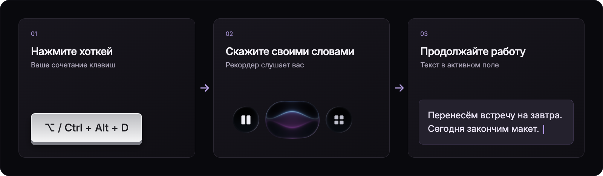
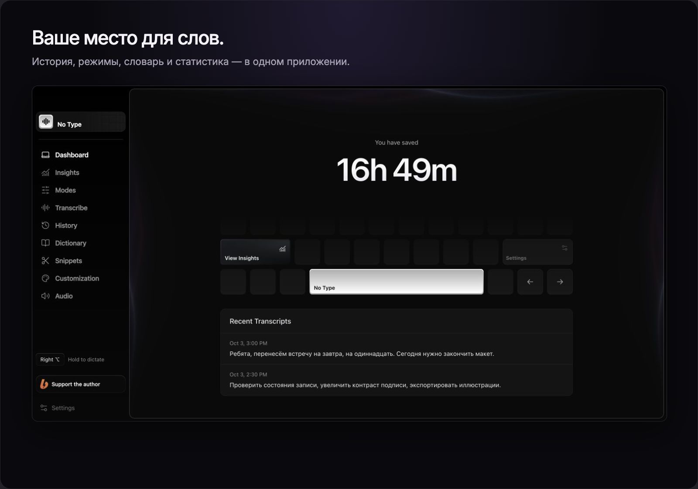
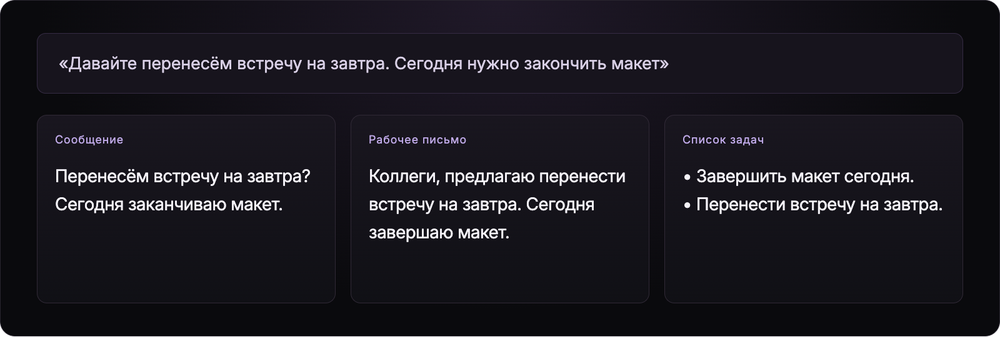
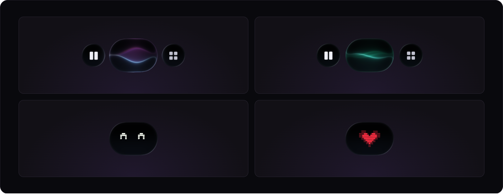

<a href="README.md">English</a> · <strong>Русский</strong>

  <picture>
  <source media="(max-width: 600px)" srcset="assets/hero-ru-mobile.png" />
  
</picture>

  
  
  

  <a href="https://www.notype.tech">Сайт проекта</a> ·
  <a href="https://github.com/Darlingfxx02/no-tipe-releases/releases/latest">Последний релиз</a> ·
  <a href="https://github.com/Darlingfxx02/no-tipe-releases/releases">Все версии</a> ·
  <a href="https://github.com/Darlingfxx02/no-tipe-releases/issues">Обратная связь</a>

**No Type превращает речь в текст для ваших приложений.** Нажмите горячую клавишу, продиктуйте мысль и получите текст в активном поле. Выбирайте локальные или облачные модели, задавайте стиль обработки и настраивайте маленький рекордер под себя.

Приложение бесплатно для личного и профессионального использования. Поддержка автора добровольная; все функции доступны без доната. Облачные провайдеры оплачиваются отдельно по их тарифам.

## От мысли до текста — три шага

<picture>
  <source media="(max-width: 600px)" srcset="assets/flow-ru-mobile.png" />
  
</picture>

Можно удерживать клавишу во время диктовки или включать и выключать запись нажатием. Сочетание и способ записи меняются в настройках. На macOS для вставки нужно разрешение «Универсальный доступ»; без него результат копируется в буфер обмена.

На Windows по умолчанию используется правый Ctrl: удерживайте его, пока говорите, и отпустите для завершения. Обновление сохраняет уже выбранные вами клавиши.

## Всё для работы со словами

Реальный интерфейс приложения. История и статистика на изображениях — демонстрационные данные; экономия времени — оценка.

| Возможность | Что можно сделать |
| :--- | :--- |
| **Локальные и облачные модели** | Скачать модель распознавания на компьютер или подключить облачный сервис со своим API-ключом. |
| **Режимы письма** | Настроить инструкции для чата, писем, заметок и задач; включить улучшение, сокращение или перевод текста. |
| **Личный словарь** | Добавить имена, термины и свои варианты исправлений. |
| **Сниппеты** | Хранить часто используемые фрагменты текста. |
| **История и аудио** | Возвращаться к диктовкам и повторять распознавание из сохранённой записи. |
| **Статистика** | Смотреть количество слов, скорость речи, активность и распределение диктовок по приложениям. |
| **Русский и английский интерфейс** | Выбрать язык вручную или следовать языку системы. |

## Одна фраза — разные результаты

<picture>
  <source media="(max-width: 600px)" srcset="assets/modes-ru-mobile.png" />
  
</picture>

Режим определяет, что делать с расшифровкой. В редакторе можно попросить убрать повторы, сохранить разговорный тон, разбить текст на абзацы или перевести его. Для обработки текста выбирается локальная или облачная текстовая модель.

Тексты в схеме — иллюстративные примеры, а не результаты замера моделей.

<strong>Посмотреть редактор инструкций и статистику</strong>

### Ваши инструкции для текста

### Как вы используете диктовку

## Маленький рекордер, большой характер

<picture>
  <source media="(max-width: 600px)" srcset="assets/recorder-ru-mobile.png" />
  
</picture>

Выберите волны или пиксельного помощника, настройте размер и палитру. Робот реагирует на поглаживание курсором. Рекордер можно разместить плавающим облачком или у верхней кромки экрана.

<strong>Посмотреть рекордер у верхней кромки в движении</strong>

Визуализация текущего компонента рекордера на абстрактных фонах macOS и Windows.

## Скачать и начать

### Сборка 0.1.5

Приложение и установщики теперь называются **No Type**. Обновление сохраняет библиотеку, настройки и сохранённые ключи доступа.

| Платформа | Требования | Установщик |
| :--- | :--- | :--- |
| **macOS** | macOS 13 или новее · Apple Silicon | [Скачать DMG](https://github.com/Darlingfxx02/no-tipe-releases/releases/download/v0.1.5/NoType_0.1.5_darwin-aarch64.dmg) |
| **Windows** | Windows 10/11 · x64 | [Скачать EXE](https://github.com/Darlingfxx02/no-tipe-releases/releases/download/v0.1.5/NoType_0.1.5_windows-x86_64-setup.exe) |

Локальный движок текстовых моделей на Windows требует AVX2. В текущем релизе нет установщиков для Intel Mac, Windows ARM и Linux. Самую новую версию всегда можно найти на [странице релизов](https://github.com/Darlingfxx02/no-tipe-releases/releases/latest).

1. **Установите приложение.** На Mac откройте DMG и перенесите No Type в «Программы». На Windows запустите EXE и следуйте шагам установщика.
2. **Разрешите доступ к микрофону.** На macOS также разрешите «Универсальный доступ» для вставки текста.
3. **Выберите распознавание.** Скачайте локальную речевую модель в приложении или подключите облачного провайдера со своим API-ключом.
4. **Настройте хоткей и попробуйте диктовку.** Откройте текстовое поле, нажмите сочетание и скажите пару предложений.

<strong>Примечания к установке и обновлениям</strong>

Сборка macOS подписана Apple Development, но пока не нотарифицирована. Установщик Windows пока без сертификата издателя Authenticode. Поэтому при первой установке система может показать предупреждение. Подробности и ограничения приведены в [заметках к версии 0.1.5](https://github.com/Darlingfxx02/no-tipe-releases/releases/tag/v0.1.5).

Сборка и автоматические тесты Windows проверяются в CI; установка и диктовка на физическом компьютере Windows пока не проверены.

Обновления можно проверять в **Settings → General → App updates**. Пакеты обновлений подписаны отдельно; эта подпись не заменяет нотарификацию Apple или сертификат издателя Windows. Обновление 0.1.5 сохраняет библиотеку, настройки и сохранённые ключи доступа.

Файлы `.app.tar.gz`, `.sig` и `latest.json` предназначены для механизма обновления. Для первой установки используйте DMG или EXE из таблицы выше.

## Поддержать No Type

  

No Type делает **Darlingfxx02**. Если приложение помогает вам в работе, поддержите его развитие на Boosty — разовым донатом или подпиской. Там же можно следить за новостями проекта.

  

Донат не открывает платные функции: пользоваться приложением можно бесплатно. Оплату обрабатывает Boosty.

Ещё один способ помочь — поставить ⭐ этому репозиторию, поделиться [сайтом](https://www.notype.tech) или [рассказать об ошибке](https://github.com/Darlingfxx02/no-tipe-releases/issues).

## Вопросы

<strong>Нужен ли интернет? Куда отправляется диктовка?</strong>

Локальные модели сначала нужно скачать. При локальном распознавании аудио обрабатывается на вашем компьютере. Для полностью локальной обработки текста выберите также локальную текстовую модель или отключите улучшение и перевод.

При выборе облачной модели аудио или текст отправляются выбранному провайдеру. Облачные сервисы требуют интернет и ваш API-ключ; их тарифы и правила обработки данных определяет провайдер.

<strong>Это бесплатное приложение с открытым исходным кодом?</strong>

No Type бесплатно для личного и профессионального использования и распространяется по [проприетарной лицензии](LICENSE). Исходный код закрыт. Этот репозиторий содержит установщики, подписанные пакеты обновлений, документацию релизов и изображения для их оформления.

Сторонние зависимости сохраняют собственные лицензии и уведомления; они доступны в приложении в **Settings → General → License and notices**. См. также [уведомления о сторонних материалах](THIRD-PARTY-NOTICES.md).

<strong>Как сообщить об ошибке или предложить идею?</strong>

Создайте [Issue](https://github.com/Darlingfxx02/no-tipe-releases/issues) и укажите версию No Type, версию ОС, выбранную модель и шаги для повторения проблемы. Приложите скриншот или точный текст ошибки, если это поможет. Перед публикацией уберите из материалов личные данные и API-ключи.

---

  © 2026 Darlingfxx02 · <a href="LICENSE">Лицензия</a> · <a href="THIRD-PARTY-NOTICES.md">Сторонние материалы</a> · <a href="https://boosty.to/notipe">Boosty</a>

